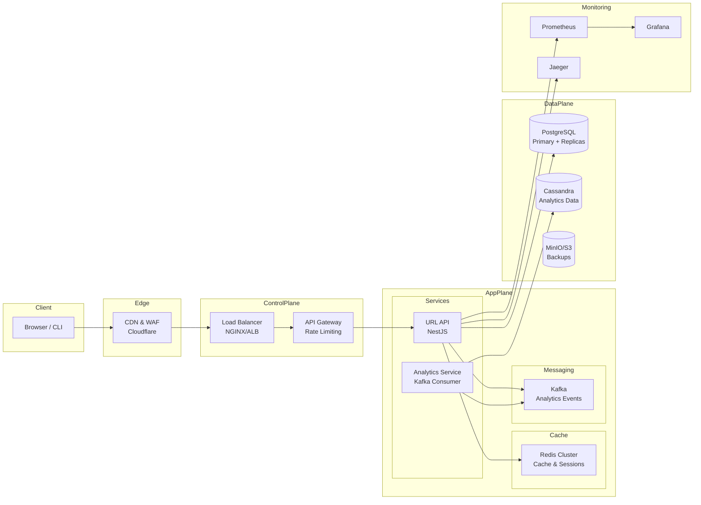

# URL Shortener Boost 🚀

[](https://github.com/your-org/url-shortener-boost/actions/workflows/ci.yml)
[](https://codecov.io/gh/your-org/url-shortener-boost)
[](https://opensource.org/licenses/MIT)
[](https://nodejs.org/)
[](https://www.typescriptlang.org/)

A production-grade, horizontally scalable URL shortener microservice built with NestJS, TypeScript, and modern cloud-native technologies. Designed for high performance, reliability, and observability.

## 🌟 Features

- **High Performance**: 10,000+ redirects/sec, <10ms p95 latency
- **Scalable Architecture**: Microservices with horizontal scaling support
- **Real-time Analytics**: Click tracking, geographic data, device analytics
- **Custom Aliases**: User-defined short codes
- **Expiration Support**: Time-based URL expiration
- **Security First**: Rate limiting, malicious URL detection, OWASP compliance
- **Production Ready**: Docker, Kubernetes, CI/CD, monitoring
- **Developer Experience**: Comprehensive API docs, type safety, testing

## 📋 Table of Contents

- [Prerequisites & Quick Start](#prerequisites--quick-start)
- [API Reference](#api-reference)
- [Architecture](#architecture)
- [Local Development](#local-development)
- [Production Deployment](#production-deployment)
- [Scaling & Performance](#scaling--performance)
- [Monitoring & Observability](#monitoring--observability)
- [Security](#security)
- [Testing](#testing)
- [Contributing](#contributing)

## 🚀 Prerequisites & Quick Start

### Local-Only Development (No External Accounts Needed)

**Requirements:**
- Node.js ≥18.x
- Docker & Docker Compose
- Git

**Get Started in 3 Steps:**

```bash
# 1. Clone and setup
git clone https://github.com/your-org/url-shortener-boost.git
cd url-shortener-boost
cp .env.example .env

# 2. Start all services
docker-compose up --build

# 3. API is ready!
curl -X POST http://localhost:3000/api/urls \
  -H "Content-Type: application/json" \
  -d '{"url": "https://example.com"}'
```

🎉 **That's it!** Your URL shortener is running at `http://localhost:3000`

- **API Documentation**: http://localhost:3000/docs
- **Health Check**: http://localhost:3000/health  
- **Metrics**: http://localhost:3000/metrics

### Optional Accounts for CI/CD

- **GitHub** (for Actions pipeline)
- **Docker Hub** or **AWS ECR** (for container registry)
- **Grafana Cloud** (for monitoring)

## 📚 API Reference

### Create Short URL

```bash
POST /api/urls
Content-Type: application/json

{
  "url": "https://example.com/very/long/url",
  "customAlias": "my-link",          # Optional
  "expiresAt": "2024-12-31T23:59:59Z" # Optional
}
```

**Response:**
```json
{
  "code": "abc123",
  "shortUrl": "https://short.ly/abc123",
  "original": "https://example.com/very/long/url",
  "createdAt": "2024-01-01T12:00:00Z",
  "isNew": true
}
```

### Redirect

```bash
GET /{code}
# Returns: 301/302 redirect to original URL
```

### URL Preview

```bash
GET /{code}/preview
```

**Response:**
```json
{
  "code": "abc123",
  "original": "https://example.com/very/long/url",
  "hitCount": 42,
  "createdAt": "2024-01-01T12:00:00Z",
  "isExpired": false
}
```

### List URLs

```bash
GET /api/urls?page=1&limit=20&sort=createdAt&order=DESC&search=example
```

### Analytics

```bash
GET /api/analytics/{code}?startDate=2024-01-01&endDate=2024-01-31&granularity=hour
```

**Response:**
```json
{
  "code": "abc123",
  "totalHits": 1547,
  "uniqueVisitors": 892,
  "timeSeries": [
    {"timestamp": "2024-01-01T12:00:00Z", "hits": 25}
  ],
  "topReferrers": [
    {"referrer": "https://google.com", "hits": 450, "percentage": 29.1}
  ],
  "geographic": [
    {"country": "US", "hits": 650, "percentage": 42.0}
  ],
  "devices": [
    {"deviceType": "desktop", "hits": 890, "percentage": 57.5}
  ]
}
```

### Admin Operations

```bash
# Delete URL (requires API key)
DELETE /api/urls/{code}
X-API-Key: your-admin-api-key

# Batch create URLs
POST /api/urls/batch
X-API-Key: your-admin-api-key
Content-Type: application/json

{
  "urls": [
    {"url": "https://example1.com"},
    {"url": "https://example2.com", "customAlias": "ex2"}
  ]
}
```

## 🏗️ Architecture

### High-Level System Design



### Technology Stack

| Layer | Technology | Purpose |
|-------|------------|---------|
| **API** | NestJS + TypeScript | RESTful API, dependency injection |
| **Database** | PostgreSQL | Primary data store, ACID compliance |
| **Cache** | Redis | URL caching, rate limiting, sessions |
| **Analytics** | Kafka + Cassandra | Real-time event processing |
| **Search** | PostgreSQL FTS | URL search and filtering |
| **Monitoring** | Prometheus + Grafana | Metrics and dashboards |
| **Tracing** | Jaeger + OpenTelemetry | Distributed tracing |
| **Deployment** | Docker + Kubernetes | Containerization and orchestration |
| **CI/CD** | GitHub Actions | Automated testing and deployment |

### Data Flow

1. **URL Shortening**: Client → API → Normalize → Check Cache → Generate Code → Store DB → Cache → Response
2. **Redirect**: Client → Cache Lookup → DB Fallback → Analytics Event → Redirect
3. **Analytics**: Hit Event → Kafka → Consumer → Cassandra → Dashboard

## 💻 Local Development

### Prerequisites

```bash
node --version  # ≥18.0.0
docker --version
docker-compose --version
```

### Setup

```bash
# Clone repository
git clone https://github.com/your-org/url-shortener-boost.git
cd url-shortener-boost

# Install dependencies
npm install

# Environment setup
cp .env.example .env
# Edit .env with your local settings

# Start infrastructure services
docker-compose up -d postgres redis kafka cassandra

# Run database migrations
npm run migration:run

# Start development server
npm run start:dev
```

### Development Workflow

```bash
# Code formatting and linting
npm run format
npm run lint

# Testing
npm test                    # Unit tests
npm run test:integration   # Integration tests
npm run test:e2e          # End-to-end tests
npm run test:cov          # Coverage report

# Database operations
npm run migration:generate  # Generate new migration
npm run migration:run      # Apply migrations
npm run migration:revert   # Revert last migration
```

### VS Code Setup

Install recommended extensions:
- TypeScript and JavaScript Language Features
- Prettier - Code formatter
- ESLint
- REST Client
- Docker

## 🌐 Production Deployment

### Docker Deployment

```bash
# Build and run with Docker Compose
docker-compose -f docker-compose.yml -f docker-compose.prod.yml up -d

# Scale API instances
docker-compose up -d --scale api=3
```

### Kubernetes Deployment

```bash
# Apply all manifests
kubectl apply -f k8s/

# Check deployment status
kubectl get pods -n url-shortener
kubectl rollout status deployment/url-shortener-api -n url-shortener

# Scale deployment
kubectl scale deployment url-shortener-api --replicas=5 -n url-shortener
```

### Environment Variables

| Variable | Description | Default | Required |
|----------|-------------|---------|----------|
| `NODE_ENV` | Environment mode | `development` | Yes |
| `DATABASE_URL` | PostgreSQL connection string | - | Yes |
| `REDIS_URL` | Redis connection string | - | Yes |
| `JWT_SECRET` | JWT signing secret | - | Yes |
| `ADMIN_API_KEY` | Admin operations API key | - | Yes |
| `BASE_URL` | Service base URL | `http://localhost:3000` | Yes |
| `ENABLE_URL_SCANNING` | Enable malicious URL scanning | `false` | No |
| `VIRUS_TOTAL_API_KEY` | VirusTotal API key | - | No |

## 🚀 Scaling & Performance

### Performance Targets

| Metric | Target | Measurement |
|--------|--------|-------------|
| **Redirect Latency** | <10ms p95 | Server-side processing |
| **Shorten Latency** | <50ms p95 | End-to-end API call |
| **Throughput** | 10k+ redirects/sec | Single instance |
| **Availability** | 99.99% | Monthly uptime |

### Horizontal Scaling

#### Application Layer
```bash
# Kubernetes HPA
kubectl apply -f k8s/hpa.yml

# Manual scaling
kubectl scale deployment url-shortener-api --replicas=10
```

#### Database Scaling

**Read Replicas:**
```yaml
# PostgreSQL read replicas for analytics queries
services:
  postgres-read-1:
    image: postgres:16-alpine
    environment:
      POSTGRES_MASTER_SERVICE: postgres
      POSTGRES_REPLICATION_MODE: slave
```

**Database Sharding:**
```typescript
// Rendezvous hashing for URL distribution
const shard = consistentHash(normalizedUrl) % SHARD_COUNT;
const connection = getShardConnection(shard);
```

#### Cache Scaling

**Redis Cluster:**
```yaml
redis-cluster:
  image: redis:7-alpine
  command: redis-server --cluster-enabled yes
  replicas: 6
```

#### Global Distribution

**Multi-Region Setup:**
- **Primary Region**: US-East (Virginia)
- **Secondary Regions**: EU-West (Ireland), AP-Southeast (Singapore)
- **CDN**: Cloudflare with global edge locations
- **Database**: Cross-region replication with eventual consistency

### Performance Optimizations

1. **URL Caching**: Redis with 1-hour TTL
2. **Database Indexing**: Optimized queries on code, normalized URL
3. **Connection Pooling**: 10 connections per instance
4. **Compression**: Gzip compression for API responses
5. **CDN**: Static assets and redirect caching
6. **Query Optimization**: Prepared statements, query analysis

## 📊 Monitoring & Observability

### Metrics & Dashboards

**Prometheus Metrics:**
```bash
# Key metrics exposed at /metrics
http_requests_total{method,route,status}
http_request_duration_seconds_bucket
url_redirects_total{status}
database_connections_active
cache_hit_rate
```

**Grafana Dashboards:**
- **Overview**: System health, request rates, error rates
- **Performance**: Latency percentiles, throughput trends
- **Business**: URL creation rates, top domains, geographic distribution
- **Infrastructure**: CPU, memory, disk, network utilization

### Alerting Rules

**Critical Alerts:**
- Error rate > 1% for 5 minutes
- p95 latency > 100ms for 5 minutes
- Database connections = 0 for 2 minutes

**Warning Alerts:**
- Cache hit rate < 70% for 15 minutes
- Memory usage > 90% for 10 minutes
- Disk usage > 85%

### Distributed Tracing

**Jaeger Integration:**
```bash
# Access tracing UI
open http://localhost:16686

# Example trace query
service=url-shortener operation=POST:/api/urls
```

### Structured Logging

**Log Format:**
```json
{
  "timestamp": "2024-01-01T12:00:00.000Z",
  "level": "info",
  "service": "url-shortener-boost",
  "requestId": "req-123",
  "method": "POST",
  "url": "/api/urls",
  "statusCode": 201,
  "duration": 45,
  "userAgent": "Mozilla/5.0...",
  "ip": "192.168.1.1"
}
```

## 🔒 Security

### Security Features

✅ **OWASP Top 10 Mitigation**
- Injection prevention with parameterized queries
- Authentication & session management
- XSS protection with Helmet.js
- Insecure direct object references prevention
- Security misconfiguration hardening

✅ **Rate Limiting**
- Token bucket algorithm
- Per-IP and per-API-key limits
- Sliding window implementation

✅ **Input Validation**
- URL format validation
- Custom alias sanitization
- Request size limits

✅ **URL Safety**
- Optional VirusTotal integration
- Malicious domain blocking
- Open redirect prevention

### Security Headers

```http
Strict-Transport-Security: max-age=31536000; includeSubDomains
X-Content-Type-Options: nosniff
X-Frame-Options: DENY
X-XSS-Protection: 1; mode=block
Content-Security-Policy: default-src 'self'
```

### Authentication & Authorization

**API Key Authentication:**
```bash
# Admin operations require API key
curl -H "X-API-Key: your-admin-key" \
     -X DELETE http://localhost:3000/api/urls/abc123
```

**JWT Support** (Optional):
```typescript
// JWT-based user sessions for advanced features
@UseGuards(JwtAuthGuard)
export class PrivateUrlController {
  // User-specific URL management
}
```

### Data Privacy

- **GDPR Compliance**: Right to deletion, data minimization
- **CCPA Compliance**: Data transparency, opt-out mechanisms  
- **PII Handling**: IP address hashing, minimal data retention
- **Audit Logging**: All admin actions logged

## 🧪 Testing

### Test Coverage

| Type | Coverage | Command |
|------|----------|---------|
| **Unit Tests** | >95% | `npm test` |
| **Integration Tests** | >90% | `npm run test:integration` |
| **E2E Tests** | Critical paths | `npm run test:e2e` |

### Test Structure

```
test/
├── unit/                    # Unit tests (*.spec.ts)
├── integration/             # Integration tests (*.integration-spec.ts)
├── e2e/                    # End-to-end tests (*.e2e-spec.ts)
├── fixtures/               # Test data and mocks
└── setup/                  # Test configuration
```

### Testing Strategy

**Unit Tests:**
- Service logic testing
- DTO validation
- Utility functions
- Error handling

**Integration Tests:**
- Database operations
- Redis caching
- External API calls
- Service interactions

**E2E Tests:**
- Complete user flows
- API endpoint testing
- Authentication flows
- Error scenarios

### Test Containers

```typescript
// Automatic test database setup
beforeAll(async () => {
  postgresContainer = await new GenericContainer('postgres:16-alpine')
    .withEnvironment({
      POSTGRES_USER: 'test',
      POSTGRES_PASSWORD: 'test',
      POSTGRES_DB: 'url_shortener_test',
    })
    .start();
});
```

## 🎯 Future Enhancements

### Roadmap

**Phase 1: Core Features** ✅
- URL shortening and redirection
- Custom aliases
- Basic analytics
- Docker deployment

**Phase 2: Advanced Analytics** 🚧
- Real-time dashboards  
- A/B testing support
- Conversion tracking
- User behavior analytics

**Phase 3: Enterprise Features** 📋
- Multi-tenancy
- White-label solution
- Advanced security (2FA, SSO)
- Bulk operations API

**Phase 4: AI & ML** 🔮
- Smart alias suggestions
- Fraud detection
- Predictive analytics
- Content categorization

### Feature Requests

Current feature requests and their priority:

- [ ] **QR Code Generation** (High)
- [ ] **Browser Extensions** (Medium)
- [ ] **Slack/Teams Integration** (Medium)
- [ ] **GraphQL API** (Low)
- [ ] **Mobile SDK** (Low)

## 🤝 Contributing

We welcome contributions! Please see our [Contributing Guide](CONTRIBUTING.md) for details.

### Development Setup

1. Fork the repository
2. Create a feature branch: `git checkout -b feature/amazing-feature`
3. Make your changes
4. Run tests: `npm test`
5. Commit: `git commit -m 'Add amazing feature'`
6. Push: `git push origin feature/amazing-feature`
7. Open a Pull Request

### Code Standards

- **TypeScript**: Strict mode enabled
- **Formatting**: Prettier with 2-space indentation
- **Linting**: ESLint with NestJS rules
- **Testing**: Jest with >95% coverage requirement
- **Documentation**: JSDoc for all public APIs

## 📄 License

This project is licensed under the MIT License - see the [LICENSE](LICENSE) file for details.

## 🙏 Acknowledgments

- [NestJS](https://nestjs.com/) - Progressive Node.js framework
- [PostgreSQL](https://www.postgresql.org/) - Advanced open source database
- [Redis](https://redis.io/) - In-memory data structure store
- [Apache Kafka](https://kafka.apache.org/) - Distributed streaming platform
- [Prometheus](https://prometheus.io/) - Monitoring and alerting toolkit

---

## 📞 Support

- **Documentation**: [GitHub Wiki](https://github.com/your-org/url-shortener-boost/wiki)
- **Issues**: [GitHub Issues](https://github.com/your-org/url-shortener-boost/issues)
- **Discussions**: [GitHub Discussions](https://github.com/your-org/url-shortener-boost/discussions)
- **Email**: support@your-domain.com

---

<div align="center">
  <strong>Built with ❤️ for the developer community</strong>
  <br />
  <sub>Made by <a href="https://github.com/your-org">Your Organization</a></sub>
</div>